# 🚀 OpenShift 4.x UPI Installation on vSphere (v8)

This guide provides a step-by-step walkthrough for deploying an OpenShift 4.18 cluster using User Provisioned Infrastructure (UPI) on a VMware vSphere environment.

---

## ✅ Overview

- **Cluster Topology:**
  - 3 x Control Plane (Master) Nodes
  - 2 x Compute (Worker) Nodes
  - 1 x HAProxy Load Balancer (CentOS10)
  - 1 x DNS Server + Bastion Host (CentOS10)

- **Platform:** vSphere 8.0
- **Domain:** `ocp4.tayyabtahir.com`


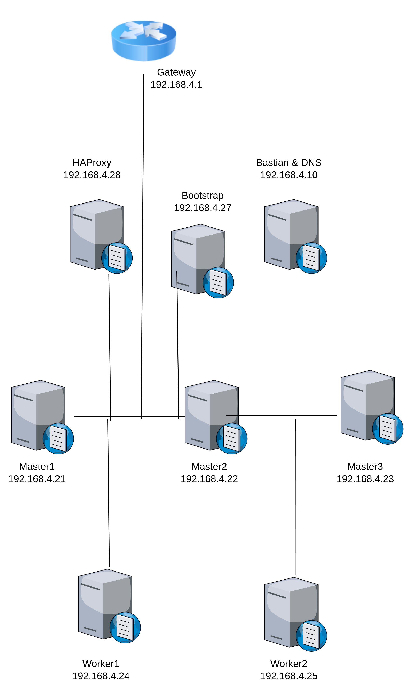


---
Important: Openshift installation depend on these 2 dns records, they should be redirected to haproxy and haproxy should redirect them to all master nodes.
* api-int.ocp4.tayyabtahir.com
* api.ocp4.tayyabtahir.com

These records are mandatory, other all records are optional but better to have them as well.


---

## 🏠 Environment Prerequisites

- vCenter Server accessible from the bastion
- Static IPs reserved for all nodes and LB
- DNS server for internal name resolution
- RHCOS ISO downloaded
- Pull secret from Red Hat account
- Internet access (for image pulling)

---

## 📝 DNS Records (Example)

| Hostname                         | IP Address       | Description       |
|----------------------------------|------------------|-------------------|
| api.ocp4.Tayyabtahir.com          | 192.168.4.28   | API VIP (LB)      |
| api-int.ocp4.Tayyabtahir.com     |  192.168.4.28    |  API-INT (LB)
| *.apps.ocp4.Tayyabtahir.com       | 192.168.4.28   | Ingress VIP (LB)  |
| bootstrap.ocp4.Tayyabtahir.com    | 192.168.4.27   | Bootstrap node    |
| master1.ocp4.Tayyabtahir.com | 192.168.4.21 | Master node      |
| master2.ocp4.Tayyabtahir.com | 192.168.4.22 | Master node      |
| master3.ocp4.Tayyabtahir.com | 192.168.4.23 | Master node      |
| worker1.ocp4.yamlforce.com | 192.168.4.24 | Worker node      |
| worker2.ocp4.yamlforce.com | 192.168.4.25 | Worker node      |

---

## 🚧 Tooling Setup
Disable firewalld and selinux on Bastion host and LB node.
```bash
systemctl disable firewalld --now
sed -i 's/enforcing/disabled/' /etc/selinux/config
```
Then reboot the VM.
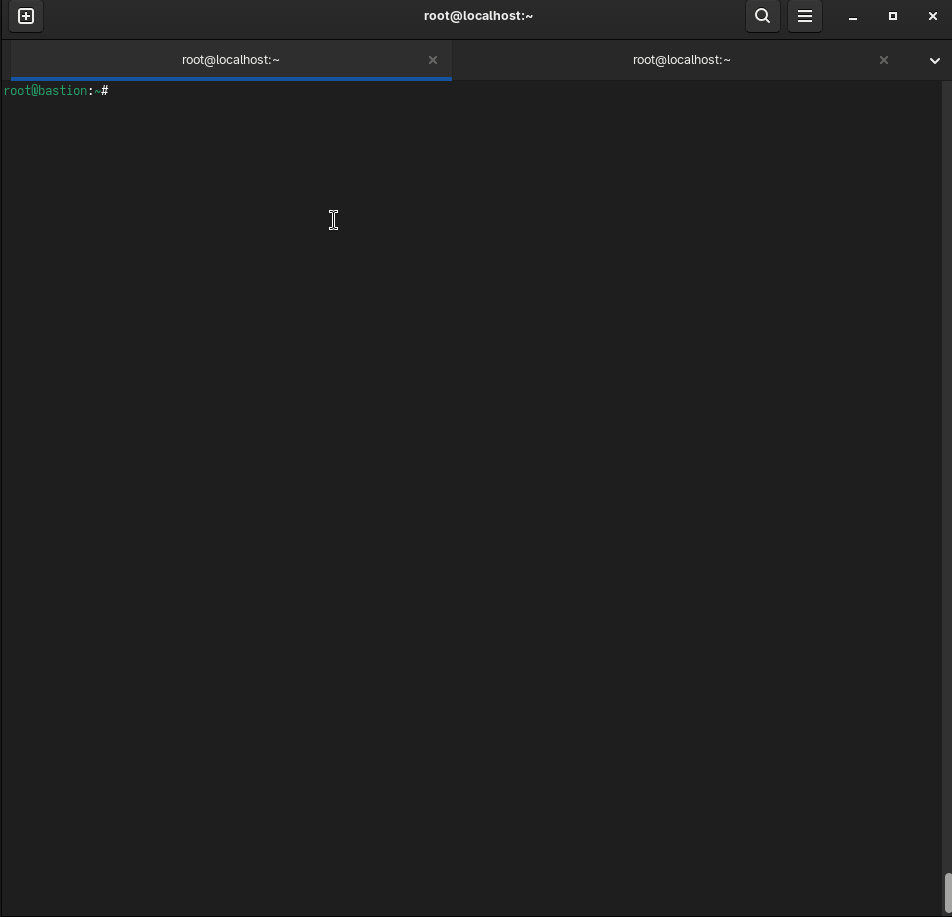

#Install openshift-install cli, oc and kubectl utilities.


```bash
dnf install -y wget git curl jq bind-utils

# Download Installer and CLI
wget https://mirror.openshift.com/pub/openshift-v4/clients/ocp/latest/openshift-install-linux.tar.gz
wget https://mirror.openshift.com/pub/openshift-v4/clients/ocp/latest/openshift-client-linux.tar.gz

tar -xzf openshift-install-linux.tar.gz
sudo mv openshift-install /usr/local/bin/

tar -xzf openshift-client-linux.tar.gz
sudo mv oc kubectl /usr/local/bin/
```
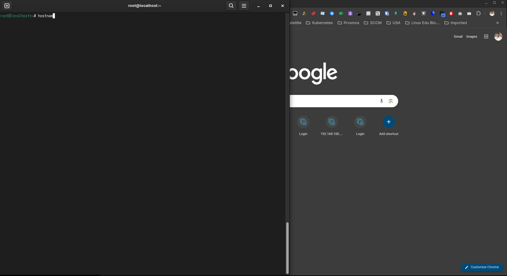

#Configure DNS and DHCP

```bash
dnf install dnsmasq -y

> /etc/dnsmasq.conf       #remove all current configs in the file.
vim /etc/dnsmasq.conf
domain-needed
bogus-priv
server=8.8.8.8
server=8.8.4.4
#server=8.8.8.8
listen-address=192.168.4.10
no-poll
addn-hosts=/etc/dnshost
domain=ocp4.tayyabtahir.com
#domain=assister.local
resolv-file=/etc/resolv.conf
address=/.apps.ocp4.tayyabtahir.com/192.168.4.28    #Wildcard dns record.                                                        
#address=/.apps.oscp.intern.beon.net/10.1.13.196

##DHCP Configuration
dhcp-range=ens33,192.168.4.2,192.168.4.30,255.255.255.0,4m
#dhcp-range=tftp,10.10.0.221,10.10.0.250
#dhcp-host=mylaptop,192.168.0.199,36h
dhcp-option=option:router,192.168.4.1
#dhcp-option=option:ntp-server,192.168.0.5
#dhcp-option=19,0 # ip-forwarding off
#dhcp-option=44,192.168.0.5 # set netbios-over-TCP/IP aka WINS
#dhcp-option=45,192.168.0.5 # netbios datagram distribution server
#dhcp-option=46,8           # netbios node type
interface=ens33
#bind-interfaces
#listen-address=10.10.0.164
dhcp-host=00:50:56:b3:a2:26,192.168.4.27

dhcp-host=00:50:56:b3:e0:58,192.168.4.21
dhcp-host=00:50:56:b3:81:04,192.168.4.22
dhcp-host=00:50:56:b3:6a:d0,192.168.4.23

dhcp-host=00:50:56:b3:f0:eb,192.168.4.24
dhcp-host=00:50:56:b3:0e:f1,192.168.4.25
```


#Configure /etc/dnshost file.

```bash
vim /etc/dnshost
192.168.4.10 bastian.ocp4.tayyabtahir.com bastian

192.168.4.21 master1.ocp4.tayyabtahir.com master1
192.168.4.22 master2.ocp4.tayyabtahir.com master2
192.168.4.23 master3.ocp4.tayyabtahir.com master3

192.168.4.24 worker1.ocp4.tayyabtahir.com worker1
192.168.4.25 worker2.ocp4.tayyabtahir.com worker2

192.168.4.27 bootstrap.ocp4.tayyabtahir.com bootstrap

192.168.4.28 lb.ocp4.tayyabtahir.com lb
 

192.168.4.28 api.ocp4.tayyabtahir.com api
192.168.4.28 api-int.ocp4.tayyabtahir.com api-int
```
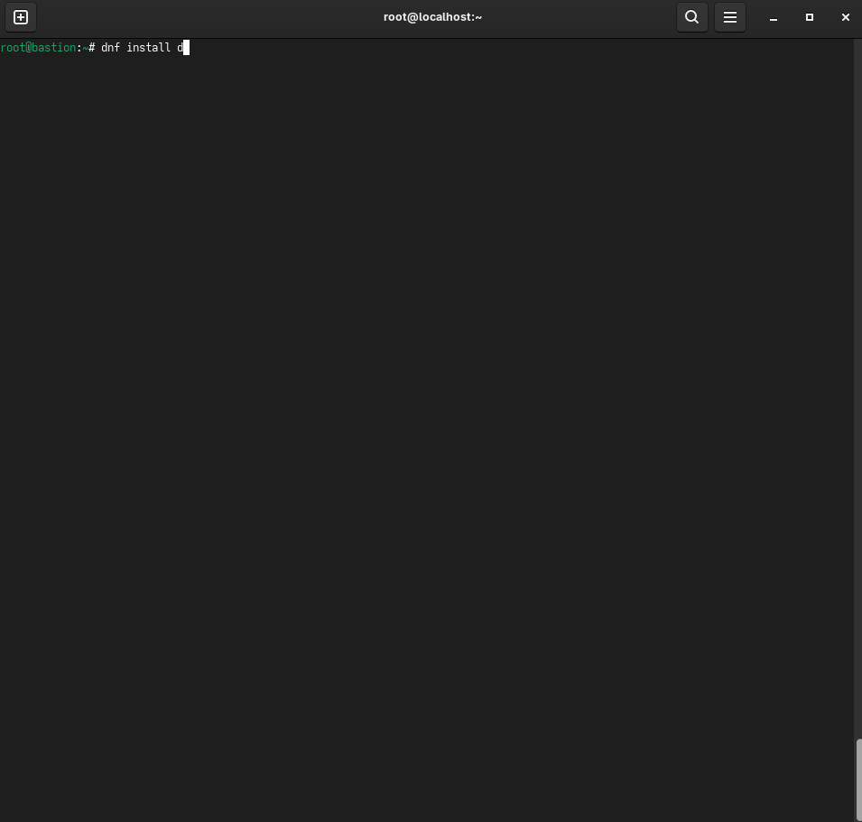

---
## 🔹 HAProxy Configuration

```bash
dnf install haproxy -y
vim /etc/haproxy/haproxy.cfg
global
  log         127.0.0.1 local2
  pidfile     /var/run/haproxy.pid
  maxconn     4000
  daemon
defaults
  mode                    http
  log                     global
  option                  dontlognull
  option http-server-close
  option                  redispatch
  retries                 3
  timeout http-request    10s
  timeout queue           1m
  timeout connect         10s
  timeout client          1m
  timeout server          1m
  timeout http-keep-alive 10s
  timeout check           10s
  maxconn                 3000
listen api-server-6443 
  bind *:6443
  mode tcp
  option  httpchk GET /readyz HTTP/1.0
  option  log-health-checks
  balance roundrobin
  server bootstrap bootstrap.ocp4.tayyabtahir.com:6443 verify none check check-ssl inter 10s fall 2 rise 3 backup 
  server master1 master1.ocp4.tayyabtahir.com:6443 weight 1 verify none check check-ssl inter 10s fall 2 rise 3
  server master2 master2.ocp4.tayyabtahir.com:6443 weight 1 verify none check check-ssl inter 10s fall 2 rise 3
  server master3 master3.ocp4.tayyabtahir.com:6443 weight 1 verify none check check-ssl inter 10s fall 2 rise 3
listen machine-config-server-22623 
  bind *:22623
  mode tcp
  server bootstrap bootstrap.ocp4.tayyabtahir.com:22623 check inter 1s backup 
  server master1 master1.ocp4.tayyabtahir.com:22623 check inter 1s
  server master2 master2.ocp4.tayyabtahir.com:22623 check inter 1s
  server master3 master3.ocp4.tayyabtahir.com:22623 check inter 1s
listen ingress-router-443 
  bind *:443
  mode tcp
  balance source
  server worker1 worker1.ocp4.tayyabtahir.com:443 check inter 1s
  server worker2 worker2.ocp4.tayyabtahir.com:443 check inter 1s
listen ingress-router-80 
  bind *:80
  mode tcp
  balance source
  server worker1 worker1.ocp4.tayyabtahir.com:80 check inter 1s
  server worker2 worker2.ocp4.tayyabtahir.com:80 check inter 1s

```
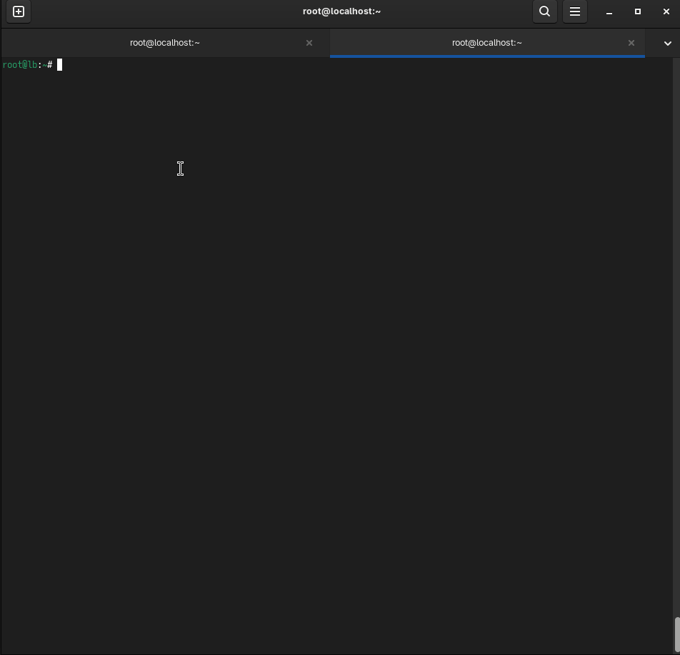

---

## 📚 Create install-config.yaml

Copy the pull secret from Redhat Openshift Console: https://console.redhat.com/openshift/install/vsphere/user-provisioned , and add in install-config.yaml file.

Add your public ssh key which can be generated with the command:
ssh-keygen


```yaml
apiVersion: v1
baseDomain: tayyabtahir.com
metadata:
  name: ocp4
additionalTrustBundlePolicy: Proxyonly

compute:
- name: worker
  replicas: 0
  architecture: amd64
  platform: {}

controlPlane:
  name: master
  replicas: 3
  architecture: amd64
  platform: {}

networking:
  clusterNetwork:
  - cidr: 10.128.0.0/14
    hostPrefix: 23
  networkType: OVNKubernetes
  serviceNetwork:
  - 172.30.0.0/16

platform:
  vsphere:
    diskType: thin
    failureDomains:
    - name: primary
      region: qld-home
      zone: default
      server: 192.168.4.110
      topology:
        datacenter: QLD-Home-DataCenter
        datastore: /QLD-Home-DataCenter/datastore/NVME-4tb-1
        networks:
        - Vlan4-T440
        computeCluster: /QLD-Home-DataCenter/host/Home-Cluster
        folder: /QLD-Home-DataCenter/vm/T440/4.0-Network
    vcenters:
    - server: 192.168.4.110
      user: user@tayyabtahir.com
      password: <your vcenter password>
      port: 443
      datacenters:
      - QLD-Home-DataCenter
fips: false
pullSecret: '<YOUR_PULL_SECRET>'
sshKey: '<YOUR_SSH_PUBLIC_KEY>'
```
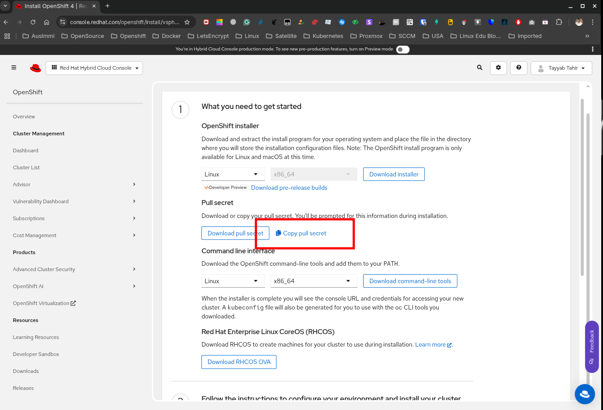
---

## 📆 Generate Manifests

create a folder and copy the install-config.yaml file in it.
Then generate manifests from ocp4 folder.


```bash
mkdir ocp4

cp install-config.yaml ocp4/

openshift-install create manifests --dir ocp4
```


Remove machine API manifests.
Go inside the folder ocp4 and run the following command:

```bash
 rm -f openshift/99_openshift-cluster-api_master-machines-*.yaml openshift/99_openshift-cluster-api_worker-machineset-*.yaml openshift/99_openshift-machine-api_master-control-plane-machine-set.yaml
```

Check that the mastersSchedulable parameter in the ocp4/manifests/cluster-scheduler-02-config.yml Kubernetes manifest file is set to false. This setting prevents pods from being scheduled on the control plane machines

```bash
vim manifests/cluster-scheduler-02-config.yml
```

Locate the ```mastersSchedulable``` parameter and ensure that it is set to ```false```.
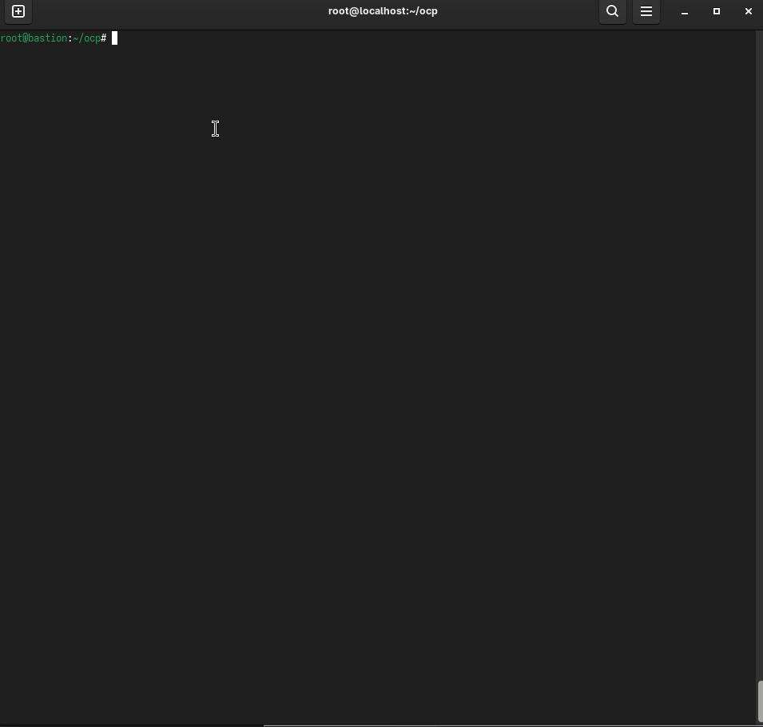

---
## ✨ Generate Ignition Configs

```bash
openshift-install create ignition-configs --dir ocp4
```
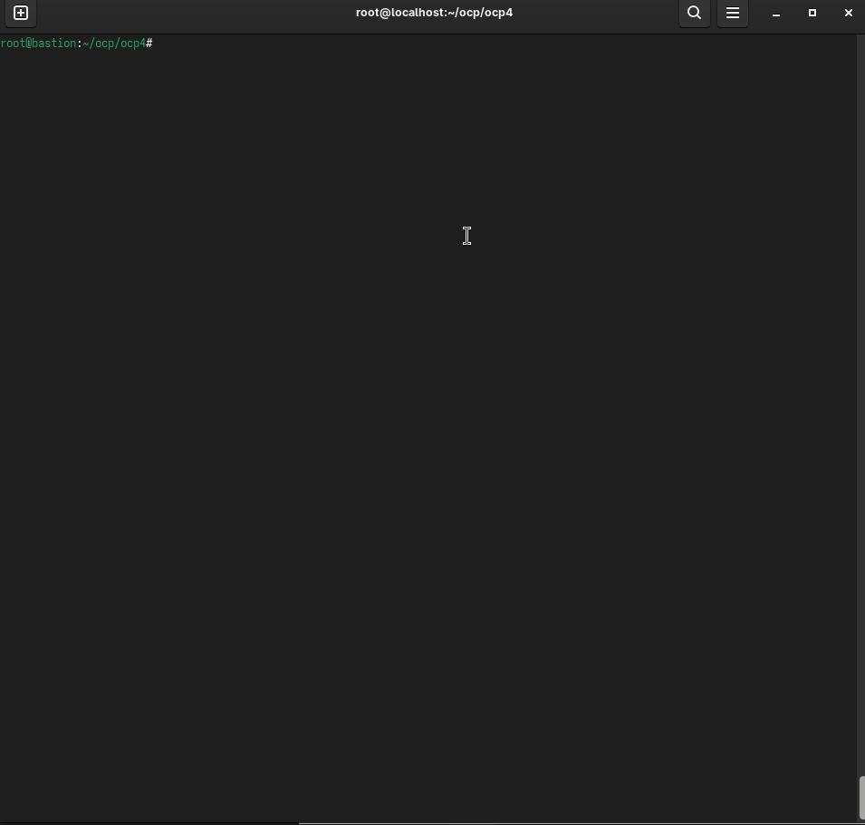
Ignition files have been generated. we need to convert them into the base64 encoding to use them as advance parameters in vsphere VMs.

```bash
cd ocp4
base64 -w0 master.ign > master.64
base64 -w0 worker.ign > worker.64
```
bootstrap.ign file is too large so we will upload it in the webserver and we will create merge-bootstrap.ign file to redirect bootstrap VM's traffic that webserver.

```bash
vim merge-bootstrap.ign
{
  "ignition": {
    "config": {
      "merge": [
        {
          "source": "http://192.168.4.10/ocp4/bootstrap.ign", 
          "verification": {}
        }
      ]
    },
    "timeouts": {},
    "version": "3.2.0"
  },
  "networkd": {},
  "passwd": {},
  "storage": {},
  "systemd": {}
}
```

Then convert this merge-bootstrap.ign in base64 encoding.
```bash
base64 -w0 merge-bootstrap.ign > merge-bootstrap.64
```

Configure the webserver and move the bootstrap.ign file in document root directory.

```bash
dnf install httpd -y

mkdir /var/www/html/ocp4
cp bootstrap.ign /var/www/html/ocp4/
chmod 777 /var/www/html/ocp4/bootstrap.ign
systemctl enable httpd --now
```
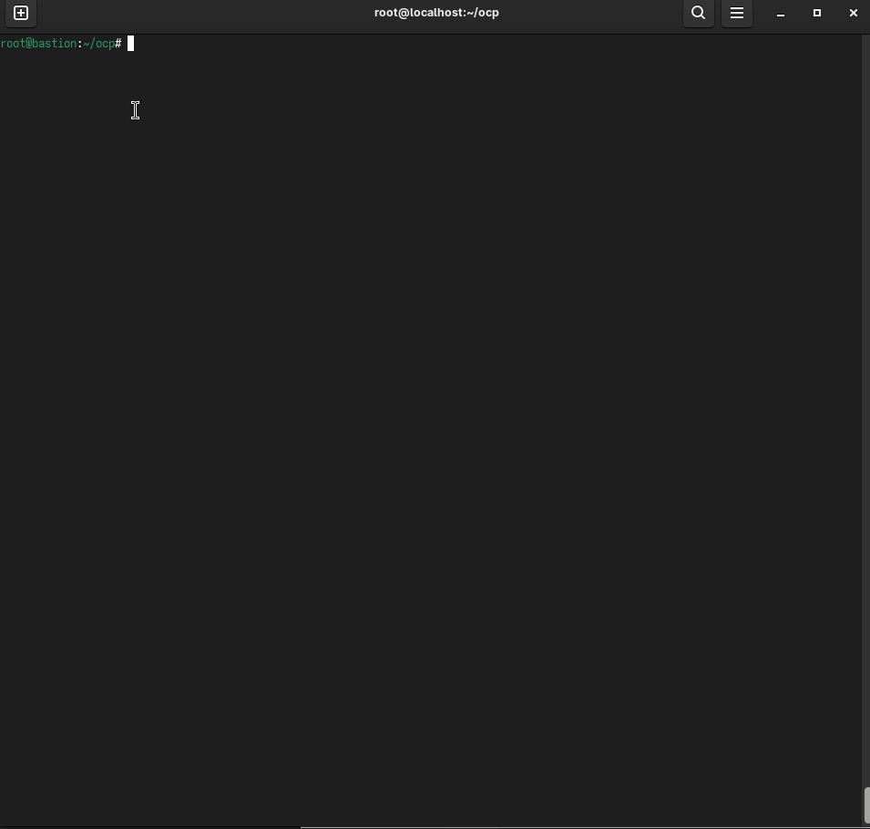
---
## 🚗 Create vSphere VMs
Obtain the RHCOS OVA image. Images are available from the RHCOS image mirror page:https://mirror.openshift.com/pub/openshift-v4/dependencies/rhcos/latest/

Download the latest RHCOS and create a template in vsphere. using this template we can create all master and worker VMs.
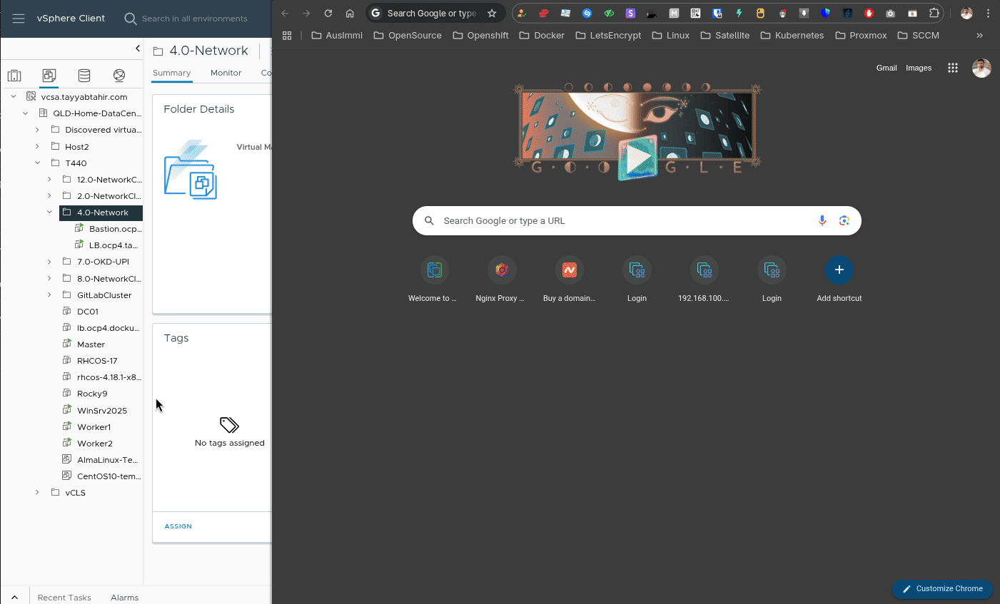

Provision the following:
- `bootstrap`: RHCOS with `merge-bootstrap.64`
- `master-1/2/3`: RHCOS with `master.64`
- `worker-1/2`: RHCOS with `worker.64`

Create the Bootstrap VM from template with $ CPUs and 16GB RAM.
Go to advance Parameters and set the following values:

guestinfo.ignition.config.data : "merge-bootstrap.64 file value"

guestinfo.ignition.config.data.encoding : base64

disk.EnableUUID:  TRUE
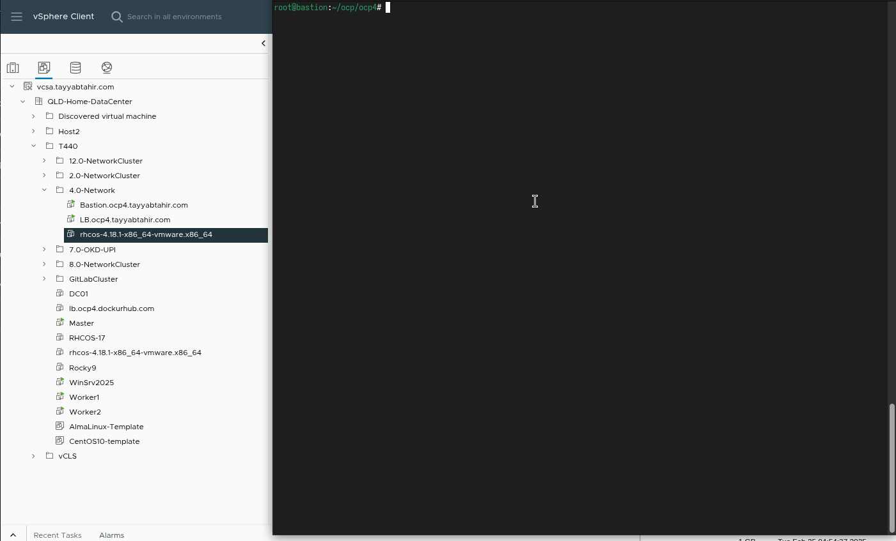

Create the Master1 VM and copy the master.64 file date in advance parameters.
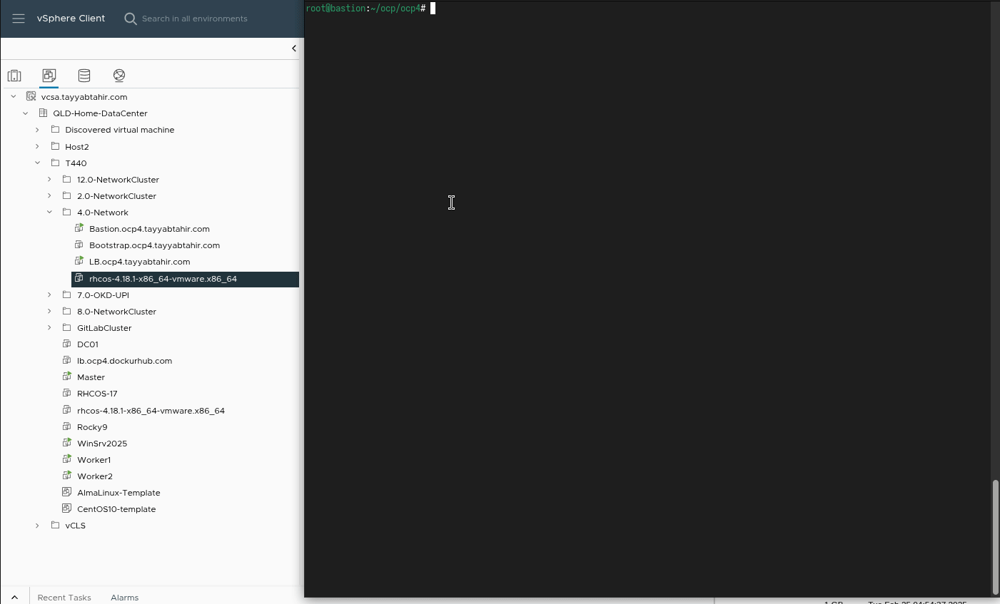

Copy the master1 and create master2 and master3.
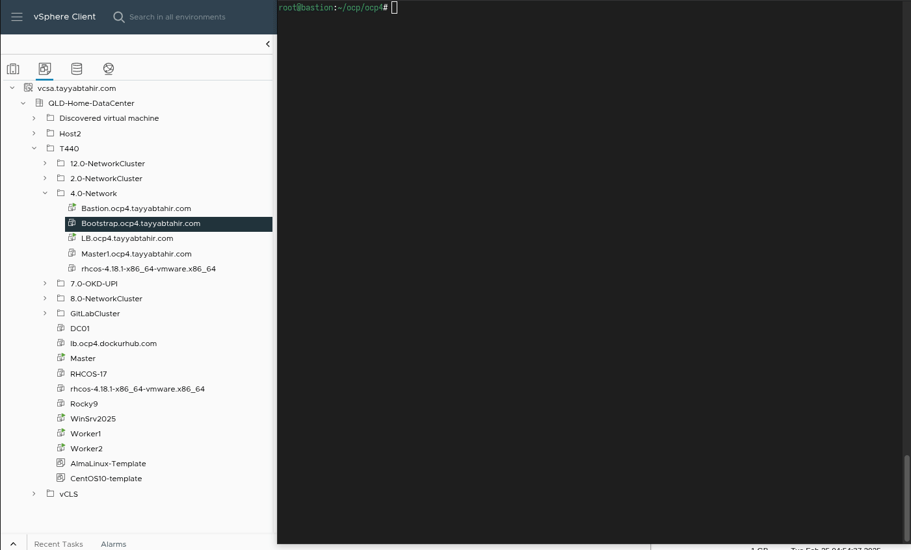

Create worker1 and worker2 VMs.
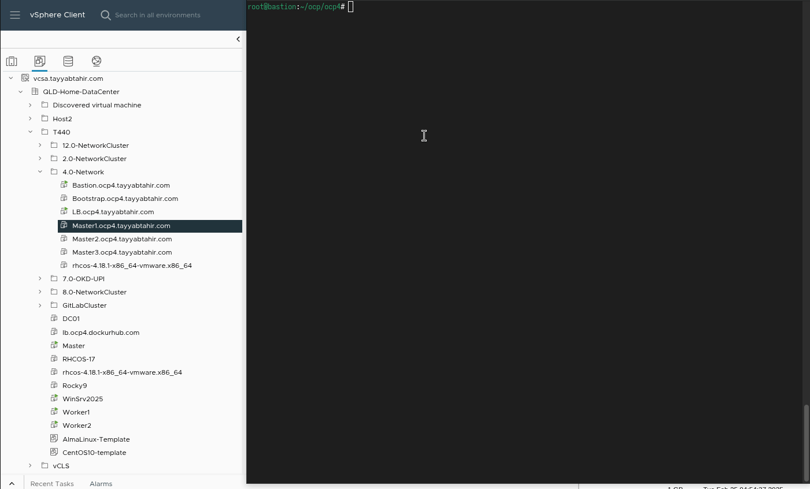

---

## MAC Address to IP Binding.
copy the mac addresses of all VMs and update them in dnsmasq file as per diagram.

```bash
vim /etc/dnsmasq.conf
dhcp-host=00:50:56:b3:c6:4a,192.168.4.27

dhcp-host=00:50:56:b3:55:92,192.168.4.21
dhcp-host=00:50:56:b3:69:09,192.168.4.22
dhcp-host=00:50:56:b3:6f:62,192.168.4.23

dhcp-host=00:50:56:b3:4b:50,192.168.4.24
dhcp-host=00:50:56:b3:24:01,192.168.4.25
```
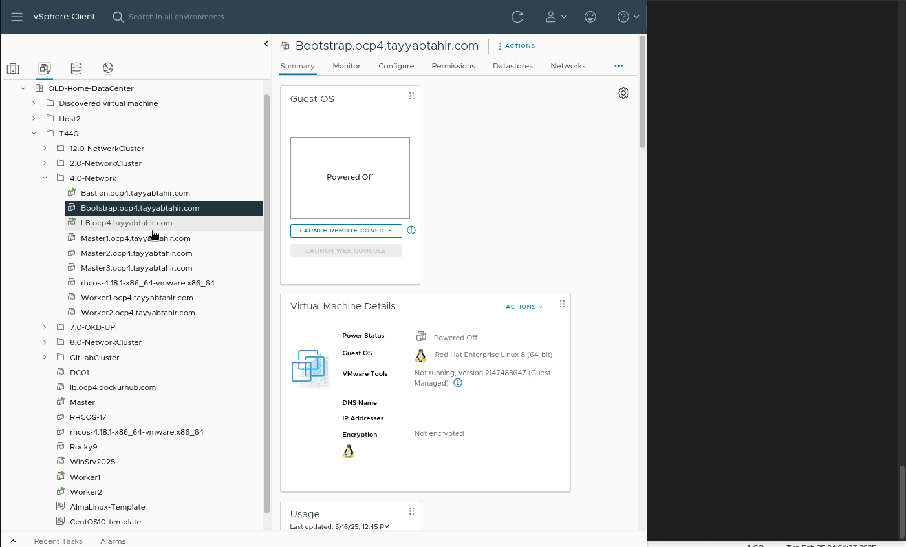

---

## ⏳ Bootstrap Completion
Start the bootstrap VM and verify if it has got the ignition data?

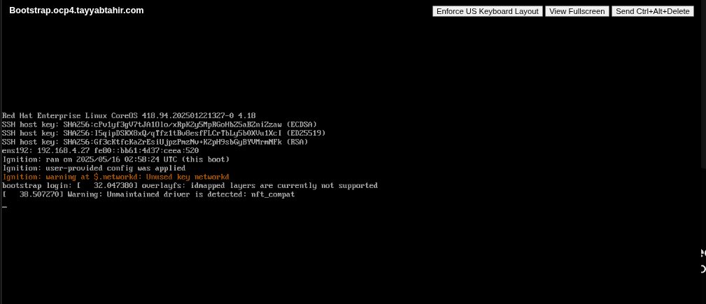


Run this command in bastian host installation directory: 
```bash
openshift-install wait-for bootstrap-complete --dir ocp4 --log-level=info
```

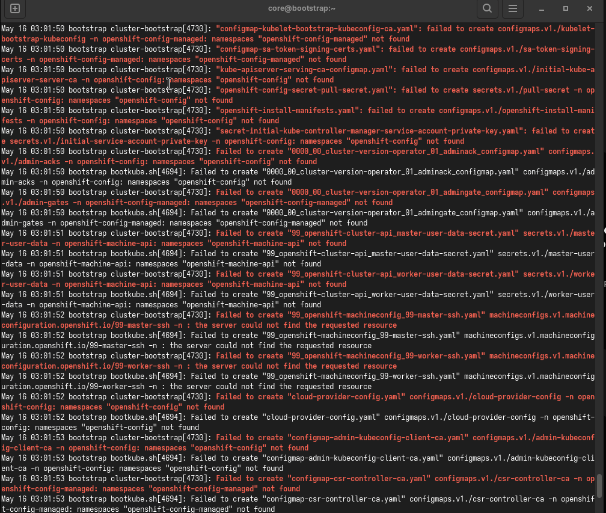

SSH the bootstrap node using core user from the bastian host and run the following commands to see the bootstrap bootkube logs :
```bash
ssh core@bootstrap
journalctl -b -f -u release-image.service -u bootkube.service
```


Start all the master nodes as well. and wait for almost 01:30 hours.

Once the "wait-for bootstrap-complete" command completes, Configure the kubeconfig file from the installation directory and verify the master nodes.


```bash
mkdir /root/.kube
cat ocp4/auth/kubeconfig > /root/.kube/config

oc get nodes
NAME      STATUS   ROLES                  AGE   VERSION
master1   Ready    control-plane,master   42m   v1.31.7
master2   Ready    control-plane,master   43m   v1.31.7
master3   Ready    control-plane,master   42m   v1.31.7
```
Once master nodes are ready, remove the bootstrap node and remove its entries from the haproxy as well.

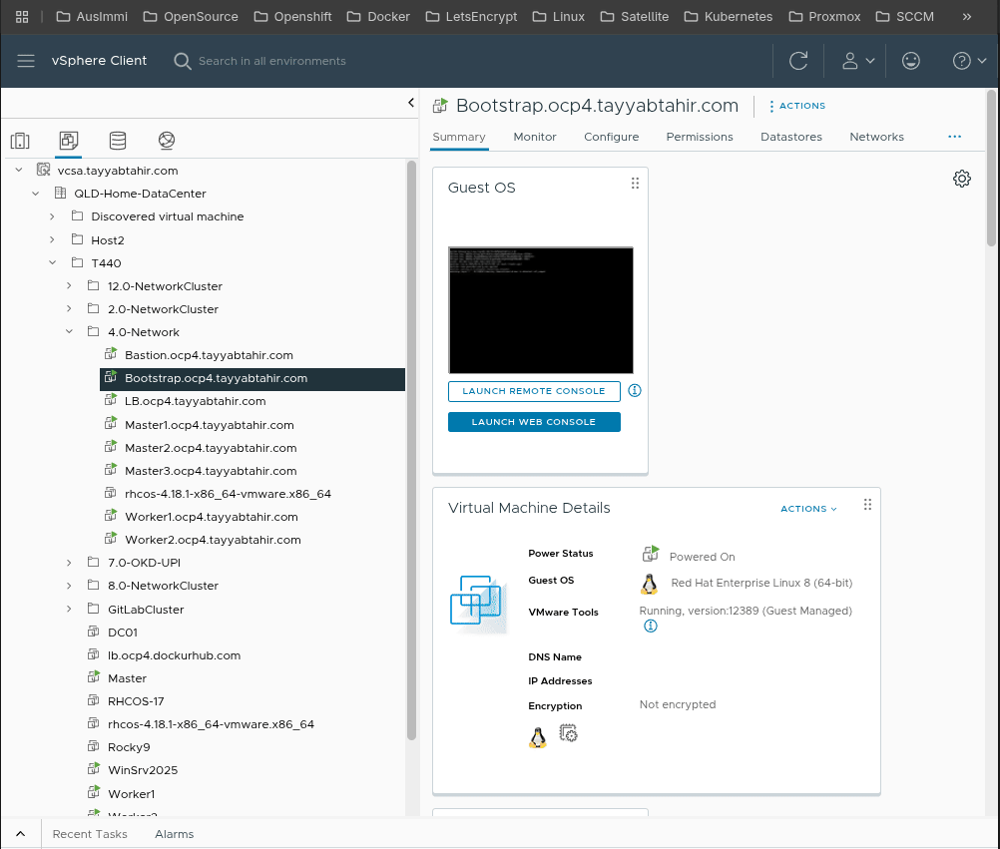


---

## 🤼‍♂️ Join Worker Nodes

Boot workers with the `worker.64` file, and they will auto-register. we just need to approve their certificates once they are registered. 
Start the worker nodes, and wait for 20 minutes.


Verify if there is any certificate pending? if yes, approve them with the following command.

Check:
```bash
oc get nodes
oc get csr
oc get csr -o go-template='{{range .items}}{{if not .status}}{{.metadata.name}}{{"\n"}}{{end}}{{end}}' | xargs --no-run-if-empty oc adm certificate approve

```
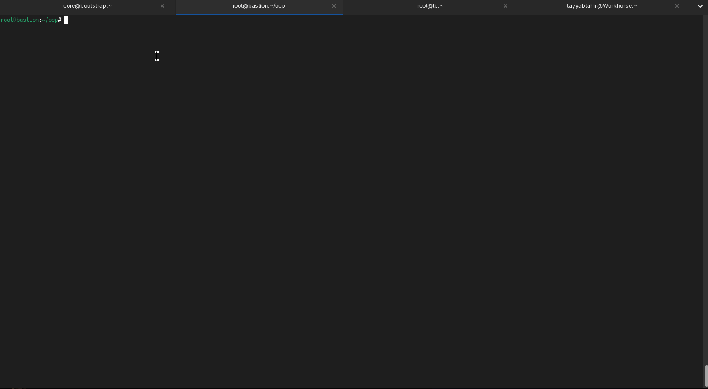


Once certificates are approved, wait for 15 minutes. Worker nodes should come up in the ready state and all Cluster operators will be ready as well.

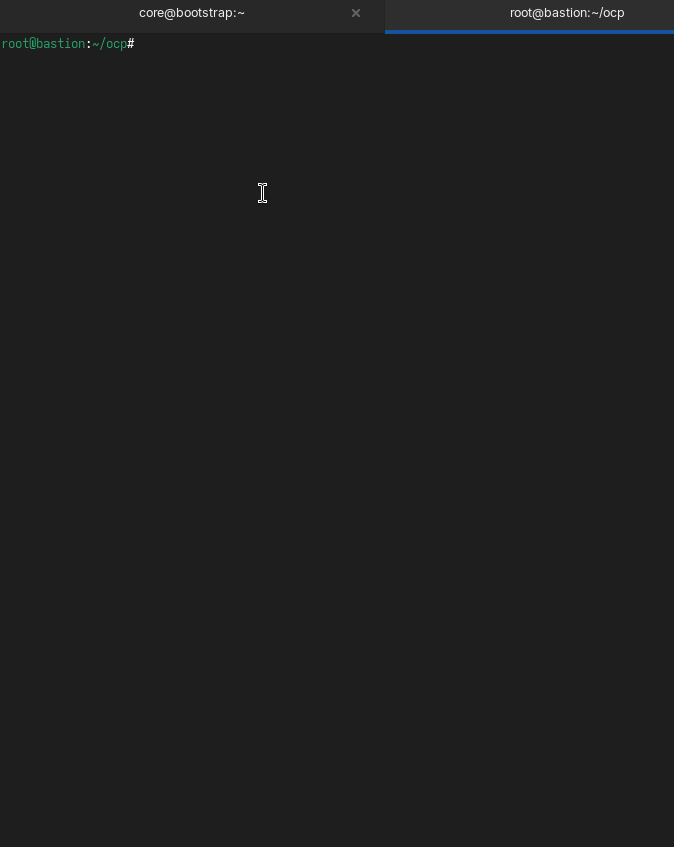

---

## 🚀 Cluster Validation

```bash
oc get co
oc get nodes
oc get pods -A
oc get route -n openshift-console
```


---

## Access openshift console on the web.
Open kubeadmin-password file in openshift installation directory /ocp4/auth/.
It contain the kebeadmin password to access the web console.


```bash
cat /ocp4/auth/kubeadmin-password
oc get route -n openshift-console
```
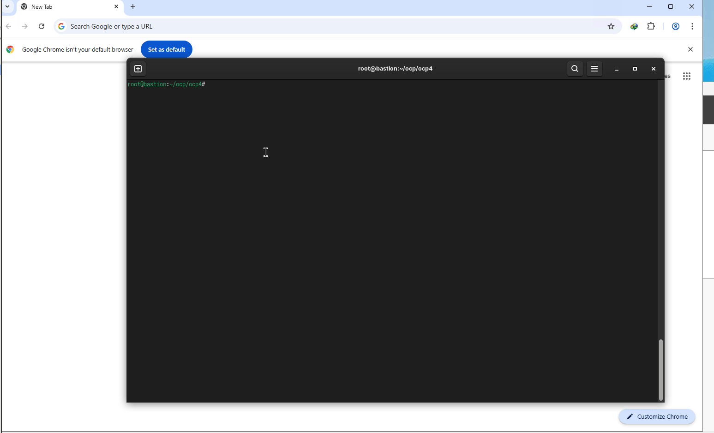


---


## 🔹 Resources

- [Official Docs](https://docs.openshift.com/container-platform/latest/installing/installing_vsphere/installing-vsphere.html)
- [Red Hat Pull Secret](https://console.redhat.com/openshift/install/pull-secret)
- [vSphere CSI Driver](https://github.com/kubernetes-sigs/vsphere-csi-driver)

---

## 😎 Author

**Tayyab Tahir**  
Senior DevOps Engineer  
Email: Tayyabtahir@tayyabtahir.com 
GitHub: [@tayyabtahir143](https://github.com/tayyabtahir143)

